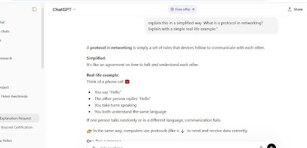
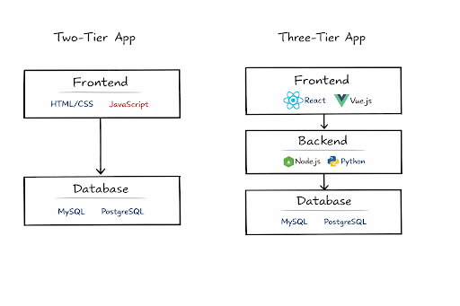
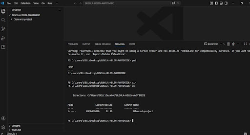

# Week 00 - Internet and Networking

Part of the DevOps Micro Internship (DMI) Cohort 3 with Agentic AI

---

# 🧑‍💻 Task 1: Using ChatGPT as Your Learning Assistant

## Scenario

You're new to DevOps and will frequently encounter technical questions. ChatGPT can be your learning companion.

## Your Task

Write a clear ChatGPT prompt to help you understand:

> "What is a protocol in networking? Explain with a simple real-life example."

Take a screenshot of your interaction showing:

* Your detailed prompt (with clear expectations)
* ChatGPT's simplified response with an example

## Screenshot

Save your screenshot in the `screenshots` folder and update the file name below.




---

## What I Learned (2–3 lines)

I learned that a protocol is just a simple set of rules that helps devices communicate properly.
Explaining it with everyday examples made it much easier to understand.
It also showed me that communication only works when both sides follow the same rules


---

# 🌐 Task 2: Internet and Networking

## Scenario

Your friend is launching an online bookstore named **EpicReads**.

He asked you to explain how users globally can access his website hosted in Finland.

## Your Task

Write a short explanation (**100–150 words**) that includes:

* Packet Switching
* IP Address
* TCP/IP
* HTTP/HTTPS

💡 **Tip:** You may use ChatGPT (as demonstrated in Task 1) to refine your explanation.

## Answer

i’ll tell my friend to Think of EpicReads like a shop in Finland that anyone in the world can visit online. When someone tries to open the website, their request is broken into small pieces using packet switching, so it can travel quickly across different routes on the internet. Each piece carries an IP address, which acts like the website’s unique home address, making sure the data gets to the right place.
These pieces move using TCP/IP, which are the rules that ensure all the packets arrive safely and are put back together correctly. Once everything arrives, HTTP/HTTPS is used to display the website in the user’s browser, with HTTPS adding security to protect user data.
All these work together to make the website accessible worldwide.


---

# 🏗️ Task 3: Application Architecture & Stack

## Scenario

EpicReads bookstore has two application versions:

### Two-Tier Application

* Frontend
* Database

### Three-Tier Application

* Frontend
* Backend
* Database

## Your Task

* Draw simple diagrams (hand-drawn or tool-based such as draw.io)
* Label each layer clearly
* List at least two common technologies or tools used for each layer
* Submit a screenshot or photo clearly showing your own drawing

## Diagram Screenshot / Photo

Save your diagram image in the `screenshots` folder and update the file name below.





---

## Technologies Used

### Frontend

* React

* Vue.js

### Backend

* Node.js
* Python


### Database

* MySQL

* PostgreSQL

---

# 🌍 Task 4: Domain Name & DNS (Basic Concepts)

## Scenario

Your friend's bookstore **EpicReads** is currently accessible through:

```text
52.172.142.222:3000
```

He purchased the domain:

```text
epicreads.com
```

## Your Task

In **50–100 words**, explain in your own words:

1. What is DNS (Domain Name System)?
2. Which DNS record type should be used to connect the domain to the given IP, and why?

## Answer

1. Hello Friend, So DNS is basically the internet’s phonebook it takes a website name like epicreads.com and tells your browser the IP address it should go to, like 52.172.142.222. 

2. To make your domain point to that IP, you’d use an A record that’s the type of DNS record that links a domain directly to an IPv4 address. Once you set that up, anyone typing epicreads.com will reach your site without needing the IP.


---

# 💻 Task 5: Visual Studio Code Setup (Hands-on)

## Your Task

Install Visual Studio Code (if not already installed).

Take a screenshot of your VS Code environment showing:

* Terminal open inside VS Code
* Running a basic command:

### Windows

```powershell
dir
```

### Linux / macOS

```bash
pwd
ls
```

* Your selected VS Code theme clearly visible

⚠️ **Important:** The screenshot must show your username or another identifiable detail to confirm it is your environment.

## Screenshot

Save your screenshot in the `screenshots` folder and update the file name below.





---

# 🔗 Task 6: Publish Your Assignment as a LinkedIn Post

## Objective

Publishing on LinkedIn helps you:

* Build your professional online presence
* Reinforce your learning
* Document your DevOps journey publicly

## Your Task

Summarize your answers from Tasks 1–5 into a LinkedIn post.

Clearly structure your post into the following sections:

* ChatGPT
* Internet & Networking
* App Architecture
* DNS
* VS Code Setup

Add the following credit note at the end of your post:

> **P.S. This post is a part of DevOps Micro Internship with Agentic AI Cohort-3 by Pravin Mishra. You can start your DevOps journey by joining this Discord community: https://discord.pravinmishra.com/**

---

## LinkedIn Post URL

 https://www.linkedin.com/posts/busola-helen-awotimide_devops-micro-internship-dmi-by-pravin-share-7447993659528065024-7l_p?utm_source=share&utm_medium=member_desktop&rcm=ACoAADtjPKMBDnsQhcIAGnVO4so-PBvk2dEBay4


```

```

---

## LinkedIn Post Backup Copy


As part of the pre-entry assessment for Pravin Mishra’s FREE DevOps Micro Internship Cohort, I completed tasks given to me . Here’s a summary of what I worked on:

1️⃣ ChatGPT
 I worked on crafting clear prompts! Asking “What is a protocol in networking? Explain with a simple real-life example” helped me understand complex networking concepts in a simple, practical way.

2️⃣ Internet & Networking
 I worked on DNS concepts basically the internet’s phonebook that converts domain names into IP addresses.
For my project, to connect epicreads.com to 52.172.142.222:3000, I worked on creating an A record, which maps a domain directly to an IPv4 address.

3️⃣ App Architecture
 I worked on the EpicReads app structure:
Two-tier: Frontend + Database
Three-tier: Frontend + Backend + Database
Technologies I worked on for each layer:
Frontend: HTML, CSS, JavaScript, React
Backend: Node.js, Python
Database: MySQL, PostgreSQL

4️⃣ DNS
 I worked on understanding key DNS record types:
A Record: domain → IPv4
CNAME: alias → another domain
MX Record: email routing

5️⃣ VS Code Setup
 I worked on setting up VS Code, running terminal commands like pwd, ls, and dir to check directories, and customizing my theme for better focus and readability.

> **P.S. This post is part of the DevOps Micro Internship with Agentic AI Cohort 3 by [Pravin Mishra](https://lnkd.in/eTmDbHF5). You can begin your DevOps journey by joining the [DMI waiting list](https://lnkd.in/eWpJQGY6). (https://lnkd.in/eMuJvtCW

---

# Reflection – Week 0

### What did you find easy?

Using VS Code and running simple terminal commands like pwd, ls, and dir was pretty smooth. I also enjoyed seeing how clear ChatGPT could explain things when I asked the right questions it felt satisfying to get quick answers

---

### What was difficult?

Figuring out which technologies fit each layer, and how DNS records work to connect domains to IPs, took some careful thinking.

---

### What will you improve next week?

Next week, I want to get more comfortable with backend and database integrations so I can really understand full-stack architecture. I also plan to practice writing better ChatGPT prompts and explore more terminal commands, so I can work faster and more confidently.

---

## 📌 About DMI & CloudAdvisory

DevOps Micro Internship (DMI) is a project-based DevOps program run by Pravin Mishra (The CloudAdvisory) focused on real-world execution, systems thinking, and career readiness.

It helps learners build strong DevOps foundations with hands-on experience.


## 📌 Resources

- 🌐 **DMI Official Website:** https://pravinmishra.com/dmi  
- 🎓 **DevOps for Beginners (Udemy):** https://www.udemy.com/course/devops-for-beginners-docker-k8s-cloud-cicd-4-projects/  
- 🎓 **Ultimate Agentic AI DevOps with Clude Code** https://www.udemy.com/course/ultimate-agentic-ai-devops-with-claude-code/?referralCode=448389767BC96284087B
- 🎓 **DevOps with Claude Code: Terraform, EKS, ArgoCD & Helm** https://www.udemy.com/course/devops-with-claude-code-terraform-eks-argocd-helm/?referralCode=1C5B734505D65A010FA3
- ▶️ **YouTube Playlist (DMI Cohort 3):** https://www.youtube.com/playlist?list=PLFeSNDtI4Cho  
- 🔗 **Pravin Mishra (LinkedIn):** https://www.linkedin.com/in/pravin-mishra-aws-trainer/  
- 🏢 **CloudAdvisory (LinkedIn):** https://www.linkedin.com/company/thecloudadvisory/

---

*This submission is part of DevOps Micro Internship (DMI) Cohort 3 — Agentic AI Track*