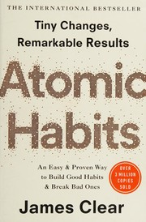
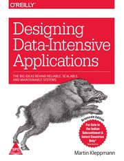
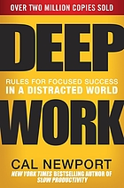
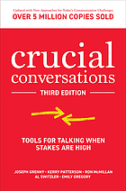
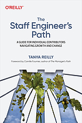
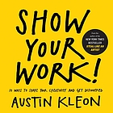
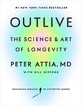
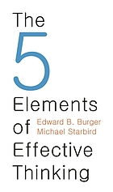

# Week 01 — Success Mindset (Mindset OS)

Part of the DevOps Micro Internship (DMI) Cohort 3 with Agentic AI

---

## Purpose (Read This First)

This week is not motivation homework.

This is you building your **Mindset OS** — the system you will use for the next 5 months (and honestly, for years).

### Expectations

* Be honest.
* Be specific.
* Be practical.
* Write like an adult professional: clear sentences, no one-liners.

You will reuse this in later weeks. So do it properly once.

---

# Assignment 1. What is something you believe to be true that most people around you would disagree with?

### Rules

* No "safe" answers.
* Must be your real belief (not copied from internet).
* Minimum 50 words.

**Hint:** What do you believe about career, money, learning, discipline, relationships, health, success, life, tech industry, etc. that most people don't agree with?

## Answer
Most people around me believe that i should only give when i have an abundance or that if i keep helping people with the little i have, i am just being stupid and letting myself get used. I completely disagree. I believe that true human connection and impact mean being willing to hold the door open for others, no matter how small your own space is. People see my giving and think I'm naive or that I don't see how others might be exploiting it but they mistake my empathy for weakness. I know exactly how hard the struggle is and I respect the sweat it takes to survive here. Keeping my head down and securing my bag isn't about hoarding wealth it's about building the capacity to keep helping without crashing. I’d rather risk being called foolish for caring too much than become cold and numb just to protect a bank balance.

---

# Assignment 2. What are the top 3 objective truths you discovered through experimentation and results?

### Definition

Objective truths do not depend on opinions. They hold true regardless of how people feel.

Write each truth in this format:

**Truth:** (1 sentence)

**Evidence from my life:** (2–4 lines: what you tried + what happened)

---

## Truth #1

### Truth

People confuse empathy with weakness, but continuing to give when you have very little is actually a conscious filter not naivety.
### Evidence from my life

When i consistently help others even while managing my  own tight budget, onlookers will literally tell me that am  being stupid or letting people ride me. But the experiment shows a different result it acts as a mirror.  The people who are trying to use me will eventually expose themselves because their demands keep growing without respect for my situation, while the people who genuinely need it will show deep, quiet gratitude. It proves that i am not the one being fooled i am are just willing to bear the cost of keeping your humanity intact.

---

## Truth #2

### Truth
The ultimate metric of financial strength isn't how much you display but how heavy an economic shock you can absorb without changing your character.
### Evidence from my life
I've seen the results of both lifestyles. People who chase the hype and spend heavily to show working are usually one bad month away from a total mental and financial crash which instantly stops them from being able to help anyone else. On the flip side, keeping my head down, securing my bags and investing quietly gives me a buffer. When inflation spikes or a rainy day hits, the result is that i don't panic, i don't become desperate and i can still cleanly extend a hand to others because your foundation is solid.

---

## Truth #3

### Truth
Respecting the sweat that brought the money in requires you to ignore the public narrative completely.

### Evidence from my life
The crowd will always have an opinion if i give quietly, they say i am are doing too little if i don't live loud, they say you have a poverty mindset. But the data shows that the public narrative is completely fickle. The moment i start spending to satisfy their expectations, my resources deplete rapidly. The objective truth is that true financial peace comes from ignoring the noise, understanding the exact value of my hard work, and channeling it into real, quiet stability rather than public approval.

---

# Assignment 3. What does your 2.0 version look like?

### Instructions

Write as if a journalist is writing about you **3 to 7 years from now** (not 20 years).

**Minimum 300 words.**

### Rules

* Write in past tense, like it already happened.
* Don't use "likes to / wants to / hopes to."
* Use specifics:

  * built
  * shipped
  * led
  * published
  * earned
  * relocated
  * contributed
* Include skills proof:

  * projects
  * portfolios
  * GitHub
  * blogs
  * certifications
  * job role
  * leadership
  * community contribution
* Add 1–3 images if you can (optional but powerful).

### Publish It Publicly On Any ONE

* LinkedIn
* Medium
* WordPress
* Blogspot
* Personal blog
* Portfolio page

Include this line:

> **P.S. This post is a part of DevOps Micro Internship with Agentic AI Cohort-3 by [Pravin Mishra](https://www.linkedin.com/in/pravin-mishra-aws-trainer/). You can start your DevOps journey by joining this [Discord community](https://discord.pravinmishra.com/) ( https://discord.pravinmishra.com/ ).**

## Your Article
The Ghost in the Machine Why You’ve Never Heard of Busola Helen Awotimide
IBADAN, NIGERIA 
If you spend any time within the flashy tech circles of South-West Nigeria, you know the drill an ecosystem fueled by loud proclamations, LinkedIn thought-leaders, and engineers who spend more time sprinting to Ibadan mixers than reviewing code. Then there is Busola Helen Awotimide. Operating from the quieter, more deliberate lanes of Ibadan, Awotimide has spent the last few years living like a ghost in the regional tech scene. It is a choice that has earned her a reputation as being fiercely disciplined to some, and frustratingly detached, even antisocial, to many of her peers. The Fortress of a Built Portfolio
While others were busy showing working to secure vanity metrics, Awotimide focused entirely on building a massive, bulletproof portfolio of production-ready infrastructure from her workspace. Critics within the local community used to call her engineering style rigid, pointing out her stubborn obsession with absolute stability over rapid, messy scaling.

But the results eventually shut down the criticism. Her built portfolio became a quiet legend among enterprise clients who needed real reliability, not startup packaging. She bypassed the local hype entirely by automating multi-region cloud deployments using Terraform and managing high-availability microservices across AWS EKS. She didn't just write code she locked down her . To her detractors, she was a hoarder of talent who refused to participate in the local scene. To her clients, she was the only engineer whose systems didn't crash.

The Friction of Strategic Conservatism
Awotimide’s financial philosophy has caused even more friction than her technical isolation. In a culture where success is traditionally validated by public display, her aggressive conservatism has frequently been mislabeled as stinginess or a poverty mindset. Busola treats capital the exact same way she treats cloud architecture, a former colleague muttered off the record. She eliminates every single line of unnecessary overhead. It makes her incredibly difficult to network with because she completely refuses to play the luxury game. But this cold, calculated approach to money was tested when inflation fluctuations tore through the tech sector, causing massive startup collapses and overnight layoffs across the country.

While the shayo crew and the flashy networkers scrambled to borrow money to maintain their rent, Awotimide didn't even flinch. Her low-key lifestyle and automated investments absorbed the shock perfectly. She proved that respecting the sweat that brought the money in matters infinitely more than buying rounds of drinks for people who only value the bottle. The Brutal Filter of Her Generosity
The most misunderstood aspect of Awotimide’s character remains her approach to helping people. Early in her career, onlookers openly mocked her, claiming she was naive or a mugu who kept letting herself get used because she insisted on giving money away even when her own budget was tight.

She responded not by hardening her heart, but by treating her empathy like an engineering script. She implemented a brutal, silent filter.She never stopped giving in fact, she quietly funded local tech bootcamps in Ibadan and stepped in for families in severe financial distress. But the moment she detected eye-service or entitlement, she cut the tap with a flat, unapologetic No.

This surgical boundary-setting alienated a lot of people. Former acquaintances labeled her as cold and calculated, unable to understand how someone could be so generous yet so unyielding. But Awotimide clearly didn't care about the bad press. By ignoring the public narrative and securing her own perimeter, she built an umbrella thick enough to survive the worst economic shifts, ensuring that her capacity to help the people who actually mattered would never run dry.

### Public Link

Paste your link here:

`__________________________`

---

# Assignment 4. Have you ever cut corners (unethical / dishonest / shortcut behavior — not necessarily illegal)? If yes, how did it make you feel?

### Important

You don't need to write the full story.

Focus on the feeling:

* guilt
* fear
* shame
* stress
* regret
* numbness
* etc.

This is about self-awareness, not judgment.

### Answer Format

**Yes / No**

If Yes:

**What emotion did you feel?** (minimum 50–100 words)

## Answer

Yes, I’ve done it. I took a shortcut on a deployment pipeline once, pushing through some messy configurations just to hit a deadline and stop the endless back-and-forth messages hitting my screen.Honestly? It felt cheap and the immediate hit of shame was sickening. You spend so much time trying to build a solid reputation but in that single moment, I realized I was just being lazy and hypocritical.

What followed was days of pure, exhausting stress. Every single time a Slack notification popped up or a server logged a minor warning, my stomach would literally drop. I was terrified of getting caught. That fear forces you into this pathetic, defensive defensive state where you are constantly looking over your shoulder, hoping nobody digs too deep into the commits. The worst part wasn't even the fear of exposure, though it was the numbness that started creeping in afterward to protect my ego. I found myself making excuses, telling myself everybody does it or it's just this once, which is a dangerous lie to start believing. It took a lot of painful self-awareness to admit that the shortcut didn't save my time it just compromised my integrity and left me with a week's worth of anxiety that took far more out of me than just doing the actual work properly would have.

---

# Assignment 5. What are 10 non-fiction books you plan to read in the next 1 year?

### Rules

* Mention **Title + Author**
* Any language allowed
* No fiction novels

### Tip

Choose books that improve:

* mindset
* communication
* productivity
* health
* money
* career
* leadership

## Book List
* 1. The Psychology of Money – Morgan Housel

* 2. Atomic Habits – James Clear

* 3. Designing Data-Intensive Applications – Martin Kleppmann

* 4. Deep Work – Cal Newport

* 5. Crucial Conversations: Tools for Talking When Stakes Are High , Joseph Grenny

* 6. The Staff Engineer's Path: A Guide for Individual Contributors Navigating Growth and Change – Tanya Reilly

* 7. Show Your Work! – Austin Kleon

* 8. The Millionaire Next Door – Thomas J. Stanley and William D. Danko

* 9. Outlive: The Science and Art of Longevity – Peter Attia

* 10. The 5 Elements of Effective Thinking – Edward B. Burger and Michael Starbird

---

# Assignment 6. What are the things you will measure regularly in your life and career?

### Rules

List topics only. No need to share numbers.

### Must Include

* Learning / skill
* Output / proof
* Health / energy
* Time / focus
* Money / finance (personal or business)

### Example

* Learning hours per week
* Deep work sessions per week
* Projects shipped / documented
* Steps / workouts
* Sleep hours
* Spending tracker

## My Metrics
* Daily water intake tracked in liters to stay sharp during intense debugging blocks
* Cloud infrastructure and architecture study hours per week
* Hands-on testing of new containerization tools or deployment scripts per month
* Technical case studies and infrastructure configurations documented or published
* Production-ready architectures added to the built portfolio per quarter
* Average sleep hours per night to prevent mental fatigue
* Hard boundaries set on distracting requests or unproductive network noise per week
* Uninterrupted deep work blocks completed per day from the workspace
* Automated monthly investments directed to the silent emergency buffer
* Fixed infrastructure costs and personal run-rate expenses tracked monthly

---

# Assignment 7. Brain Dump + 5-Month System Plan

## Step 1: Brain Dump (Private)

Do a brain dump of everything in your mind into a notebook.

Examples:

* Bills
* Tasks
* Worries
* Goals
* Pending messages
* Ideas
* Responsibilities

### Did You Do It?

**Yes / No**

Answer:

yes

---

## Step 2: Your 5-Month Routine + Focus Blocks

Create a simple plan you can realistically follow for the next 5 months.

### Weekly Routine

Example:

* Mon–Thu: 60 min deep work
* Sat: DMI session
* Sun: Weekly review

#### My Weekly Routine

* Mon–Thu: 90 mins of uninterrupted evening deep work (Spring Boot 3, AWS EKS configs or Terraform deployments)
* Fri: 60 mins tracking expenses, routing automated savings, and securing the silent buffer
* Sat: 3-hour uninterrupted focus block for building portfolio architectures and technical case study documentation
* basically for the week's activities review
---

### Focus Blocks

#### When Will You Do DMI Work? (Days + Time)

mondays -thursday (4:30pm-8:30pm)

#### How Many Sessions Per Week?

4

---

### Distraction Rules

Examples:

* Phone rules
* Social media rules
* Environment setup

#### My Distraction Rules

No social media when studying

---

# Reflection – Week 1

### Biggest insight I got about myself this week

I realized that keeping my circle small and my life low-key isn't just about privacy it's how I keep myself grounded. I function best when I have total control over my space, my work, and my finances. My desire to help people is real, but it only works if I protect my own peace first.

### My biggest weakness/loop I noticed

I tend to get paralyzed by what-if anxiety when external chaos or demanding people panic around me. Instead of just shutting it down immediately with a firm No and focusing on my work, I waste a ton of mental energy trying to track and manage their mess.

### One system I will implement from this week (exact habit + time)

Every Monday through Thursday from 8:00 PM to 9:30 PM, I will put my phone on Do Not Disturb, close all messaging apps and spend 90 straight minutes building out my cloud configurations and backend projects. No multitasking, no answering texts.

### LinkedIn Post

Paste your LinkedIn post link here:

`__________________________`

---

## 10. Proof of Work

- LinkedIn Post URL: **ADD LINK HERE**  
- Blog / Medium : **ADD LINK HERE**  

---

## 📌 About DMI & CloudAdvisory

DevOps Micro Internship (DMI) is a project-based DevOps program run by Pravin Mishra (The CloudAdvisory) focused on real-world execution, systems thinking, and career readiness.

It helps learners build strong DevOps foundations with hands-on experience.

## 📌 Resources

- 🌐 **DMI Official Website:** https://pravinmishra.com/dmi  
- 🎓 **DevOps for Beginners (Udemy):** https://www.udemy.com/course/devops-for-beginners-docker-k8s-cloud-cicd-4-projects/  
- 🎓 **Ultimate Agentic AI DevOps with Clude Code** https://www.udemy.com/course/ultimate-agentic-ai-devops-with-claude-code/?referralCode=448389767BC96284087B
- 🎓 **DevOps with Claude Code: Terraform, EKS, ArgoCD & Helm** https://www.udemy.com/course/devops-with-claude-code-terraform-eks-argocd-helm/?referralCode=1C5B734505D65A010FA3
- ▶️ **YouTube Playlist (DMI Cohort 3):** https://www.youtube.com/playlist?list=PLFeSNDtI4Cho  
- 🔗 **Pravin Mishra (LinkedIn):** https://www.linkedin.com/in/pravin-mishra-aws-trainer/  
- 🏢 **CloudAdvisory (LinkedIn):** https://www.linkedin.com/company/thecloudadvisory/

---

*This submission is part of DevOps Micro Internship (DMI) Cohort 3 — Agentic AI Track*