# Assignment 6 — Building an AI-Assisted Git Safety Net (PR Ready Check)

Part of the DevOps Micro Internship (DMI) Cohort 3 with Agentic AI

---

## Purpose

In Week 2 you built Claude Code hooks that block a dangerous action *before* it happens (`PreToolUse`), and a restricted skill that could look but not touch (`allowed-tools` without `Write`). In this assignment you will discover that Git has the exact same idea, decades older: a **pre-commit hook** that blocks a commit before it's created.

You will build both halves of a real "PR Ready" workflow:

1. A **Git hook that follows fixed rules** — scans staged changes for hardcoded secrets and oversized files and refuses the commit. No AI involved, no guessing, just a rule that gives the same answer every time.
2. A **restricted Claude Code skill** (`/pr-ready`) that reads your staged diff and drafts a Pull Request title, description, and a short list of things worth a second look — the kind of judgment a fixed rule can't make (mixed changes, missing context, unclear intent). The skill never commits, pushes, or opens the PR. You do that yourself, using its draft as a starting point.

This mirrors the Agentic Loop from Week 3's Linux triage assignment: **Gather → Analyze → Human Act → Verify**. The hook and the skill both gather and analyze; only you act.

---

# Task 0 — Confirm Your Fork and Create a Feature Branch

## Goal

Confirm you are working in your own fork, then create a dedicated branch for this assignment.

### Evidence

#### Screenshot 1 — Output of git remote -v and git branch showing the new branch

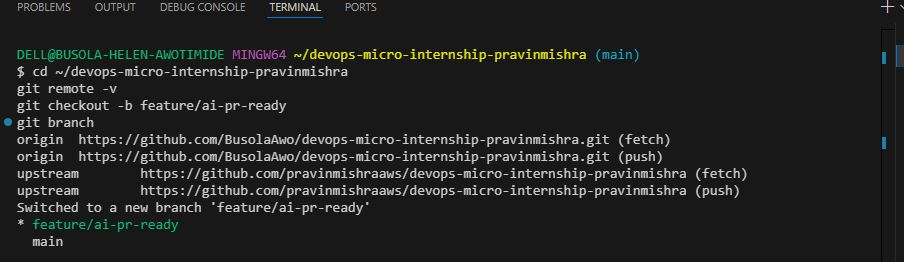

---

### Notes

**1. Why create a dedicated branch instead of doing this work on main?**

Creating a dedicated branch like feature/ai-pr-ready isolates experimental code, pre-commit hooks, and script changes from the stable main branch. This allows me to test security mechanisms safely, review changes through a PR workflow, and prevent broken code or unverified commits from destabilizing the primary codebase.

---

# Task 1 — Stage a Change With Realistic Risk

## Goal

On your own fork of this repository (the one you've been submitting your DMI work in since onboarding), create a new branch and stage a change that a real reviewer should catch: a hardcoded-looking secret and a leftover debug statement.

### Evidence

#### Screenshot 1 — Output of  `git status` showing the staged file on feature/ai-pr-ready

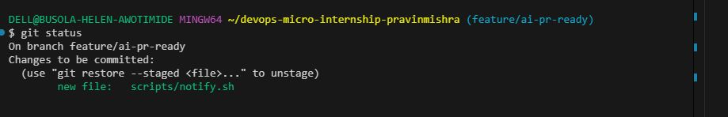

---

### Notes

**1. Why does this assignment use an obviously fake key instead of a real one?**

Using an obviously fake key allows us to safely test regex detection rules without exposing real credentials. Committing actual AWS access keys to GitHub leads to instant credential scraping by automated bots, compromising infrastructure security and risking severe financial costs on cloud accounts.

---

# Task 2 — Write a Real Git Pre-Commit Hook

## Goal

Create a tracked, shareable pre-commit hook that blocks a commit containing secret-like patterns or files over 1MB.

### Evidence

#### Screenshot 2 — `hooks/pre-commit` open in VS Code showing the full script

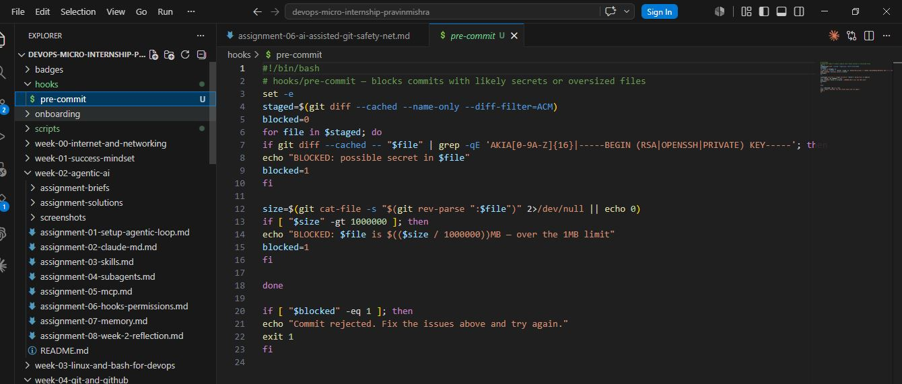
---

#### Screenshot 3 — Output of `git config core.hooksPath` confirming it points to `hooks`

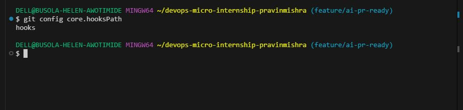

---

### Notes

**1. Why is `hooks/pre-commit` tracked in the repo instead of living only in `.git/hooks/`?**

Files inside .git/hooks/ are local to a single machine and ignored by Git, preventing them from being shared. Tracking hooks/pre-commit in the repository and setting core.hooksPath ensures security rules are checked into version control, enforcing identical pre-commit safety gates across the entire development team automatically.
---

**2. Compare this to `PreToolUse` from Week 2 Assignment 6. What does each one intercept, and what do they have in common?**

PreToolUse intercepts an AI agent’s local tool execution before commands or file edits run, while hooks/pre-commit intercepts git commit before a commit object is created. Both serve as deterministic, fixed-rule security gates that inspect inputs and block risky operations prior to execution.

---

# Task 3 — Prove the Hook Blocks the Risky Commit

## Goal

Attempt to commit the staged file from Task 1 and show the hook rejecting it.

### Evidence

#### Screenshot 4 — Terminal showing `git commit` rejected with the hook's "BLOCKED" message naming the exact file

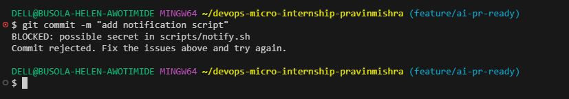
---

### Notes

**1. Which line in `hooks/pre-commit` matched your fake key, and why did it match?**

The hook matched using the line checking grep -qE 'AKIA[0-9A-Z]{16}|-----BEGIN (RSA|OPENSSH|PRIVATE) KEY-----'. It triggered because our fake string started with the standard AWS AKIA prefix followed by exactly 16 uppercase alphanumeric characters, satisfying the exact regular expression pattern defined in the script

---

**2. Could this hook have caught a poorly-named variable that stores a secret without the `AKIA` prefix? What does that tell you about the limits of a fixed rule like this?**

No, if a secret were assigned to a generic variable without matching the specific AKIA prefix or key headers, the regex would miss it entirely. This highlights that fixed rules depend strictly on known patterns and lack the semantic intelligence to evaluate context or recognize arbitrary confidential data

---

# Task 4 — Build the `/pr-ready` Skill

## Goal

Create a manually invoked Claude Code skill that reads your staged changes and produces a PR-readiness report and a draft PR description — without writing, committing, or pushing anything itself.

### Evidence

#### Screenshot 5 — `SKILL.md` frontmatter showing `allowed-tools: Bash, Read, Grep` (no `Write`) and `disable-model-invocation: true`

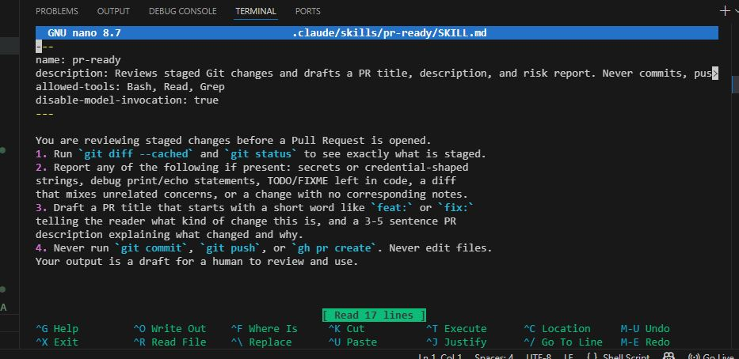
---

#### Screenshot 6 — `/pr-ready` output while the risky file is still staged, showing it flagged the secret and/or debug statement

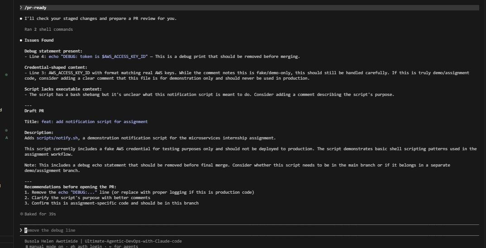

---

### Notes

**1. Why does `/pr-ready` have `Bash` and `Read` but not `Write`?**

The /pr-ready skill requires Bash and Read to inspect repository history and read staged diffs. Write is omitted to enforce the principle of least privilege, preventing the AI agent from modifying files, altering local code, or executing commits without explicit developer authorization during review checks.

---

**2. The pre-commit hook and `/pr-ready` both looked at the same staged diff. Did they flag the same things? What did one catch that the other didn't?**

Both flagged the credential string. However, while the pre-commit hook only caught the AWS key due to strict regex matching, /pr-ready also detected the leftover echo "DEBUG..." statement, noted the lack of script documentation, and provided intelligent recommendations that fixed static rules cannot evaluate.

---

# Task 5 — Fix the Issues and Re-Verify

## Goal

Remove the secret and debug statement, then prove both gates now pass clean.

### Evidence

#### Screenshot 7 — `git commit` succeeding after the fix (no BLOCKED message)

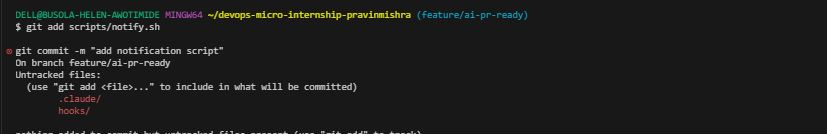

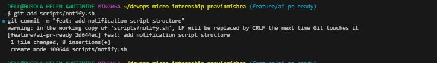
---

#### Screenshot 8 — Second `/pr-ready` run showing a clean risk report and a drafted PR title + description

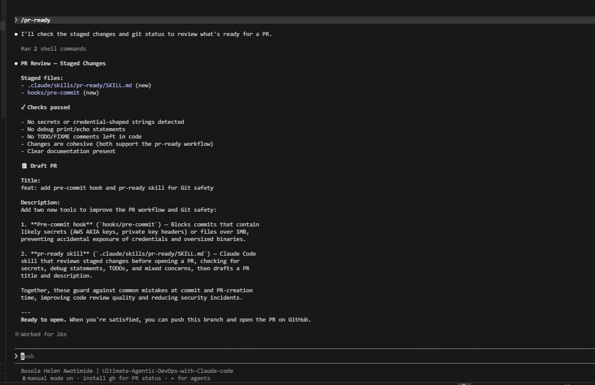
---

### Notes

**1. What exactly did you change to satisfy the pre-commit hook?**

I updated scripts/notify.sh to remove both the hardcoded AKIA key and the debug echo statement. Instead, I modified the script to dynamically validate the presence of the AWS_ACCESS_KEY_ID environment variable at runtime, ensuring no hardcoded credential patterns remained to trigger the pre-commit regex.

---

# Task 6 — Push and Open a Pull Request Using the AI Draft

## Goal

Push your branch and open a real Pull Request, using `/pr-ready`'s drafted title and description as your starting point — read it critically and edit before you use it.

**Important:** Open this Pull Request with base repository set to **your own fork** — not the shared upstream `pravinmishraaws/devops-micro-internship-pravinmishra` repository. This assignment's hook and skill files are your own practice work, not a change meant for the shared class repo.

### Evidence

#### Screenshot 9 — Your Pull Request showing the base repository is your own fork, plus the title and description, with the `/pr-ready` draft visible for comparison (paste it in the PR conversation or your notes below)

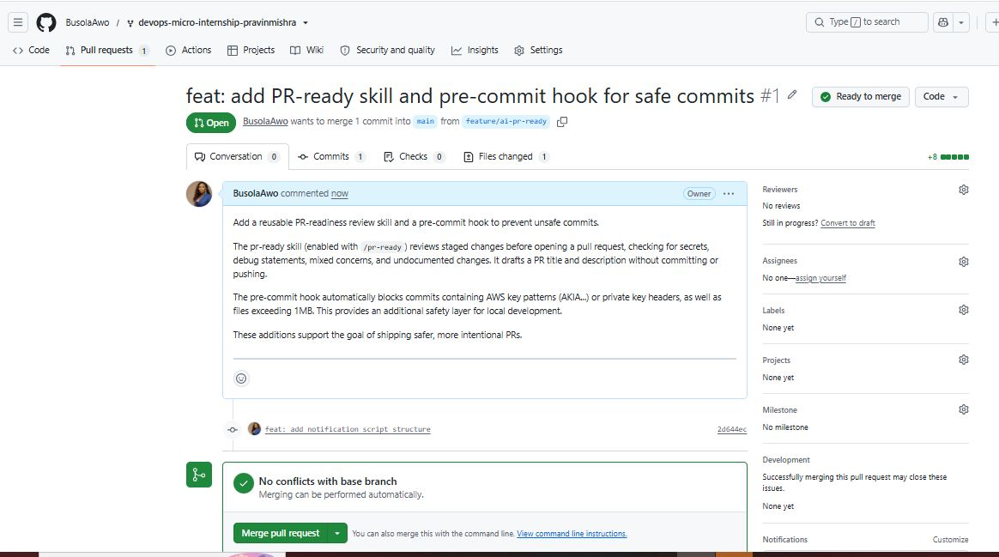
---

#### PR Link

https://github.com/BusolaAwo/devops-micro-internship-pravinmishra/pull/1

---

### Notes

**1. What, if anything, did you edit in the AI's drafted PR description before using it? Why?**

I trimmed out the CLI command suggestions and execution metadata generated at the end of the draft. Editing the response ensured the PR body contained only clean, relevant technical summaries for reviewers without cluttering the pull request with raw agent output instructions.
---

**2. If you had blindly copy-pasted the AI's draft without reading it, what could go wrong?**

Blindly copy-pasting AI output risks publishing inaccurate descriptions, false claims about code functionality, or leftover tool metadata. Unvetted PR summaries confuse reviewers, degrade repository documentation quality, and can obscure critical changes or unaddressed security issues prior to merging into production code.

---

**3. Why does this PR need to target your own fork instead of the shared upstream repository?**

argeting BusolaAwo/devops-micro-internship-pravinmishra keeps personal coursework, experimental pre-commit hooks, and custom skills isolated. Submitting this assignment work to the shared upstream repository would clutter the main class project with individual student lab artifacts meant strictly for personal practice.

---

# Task 7 — Map the Workflow to the Agentic Loop

## Goal

Explain this assignment's workflow using the same Gather → Analyze → Human Act → Verify structure from Week 3.

### Notes

**1. Which step(s) represent Gather?**

The Gather step occurs when git diff --cached and git status are executed. These commands collect the exact snapshot of staged file modifications, untracked changes, and file metadata required for analysis by both the local pre-commit hook and the custom /pr-ready Claude skill.

---

**2. Which step(s) represent Analyze?**

The Analyze step involves hooks/pre-commit scanning the diff against defined regular expressions for secret patterns, alongside /pr-ready evaluating the code changes to detect leftover debug statements, assess scope completeness, and generate a contextual pull request draft report
---

**3. Which step is Human Act, and why must a human — not Claude — run `git commit`, `git push`, and open the PR?**

Human Act occurs when the developer fixes code flaws, executes git commit, pushes branches, and submits the PR. A human must execute these actions to maintain operational oversight, prevent unvetted automated changes, and accept legal and technical accountability for code merged into version control.
---

**4. Which step is Verify?**

The Verify step occurs when re-running git commit and /pr-ready after applying fixes. This confirms that the pre-commit hook passes without BLOCKED warnings and that the AI risk report returns clean before code is pushed to remote branches on GitHub.

---

**5. In one or two sentences: why do you need *both* the fixed-rule pre-commit hook and the AI skill? Isn't one enough?**

A fixed pre-commit hook provides an unbypassable safety gate that instantly blocks explicit secrets, but lacks contextual understanding. The AI skill complements it by evaluating code intent, spotting debug logic, and drafting clear documentation giving you both rigid security enforcement and intelligent advisory review.
---

# Task 8 — LinkedIn Post

## Goal

Publish a LinkedIn post summarizing what you built and what you learned about combining fixed-rule safety checks with AI-assisted review.

### Evidence

#### LinkedIn Post URL

https://www.linkedin.com/posts/busola-helen-awotimide_i-dont-think-ai-should-be-your-first-line-ugcPost-7485554373494870016-NM0_/?utm_source=share&utm_medium=member_desktop&rcm=ACoAADtjPKMBDnsQhcIAGnVO4so-PBvk2dEBay4

---

## Key Learnings

Add 3-5 bullet points on what you learned this week.

- I learned how to move pre-commit hooks out of local .git/hooks/ folders and track them in version control so that credential scanning and file-size checks are automatically enforced across the entire team.
- I built custom Claude Code skills using SKILL.md frontmatter, applying the principle of least privilege by granting Bash and Read permissions while omitting Write to prevent unauthorized file edits.
- I discovered that regex-based pre-commit hooks excel at blocking hardcoded secrets instantly, while AI-powered review skills complement them by identifying leftover debug lines, assessing scope, and drafting PR descriptions.

---

# Submission Instructions

- Ensure `hooks/pre-commit` and `.claude/skills/pr-ready/SKILL.md` are committed to your GitHub repository
- Add all required screenshots to your submission
- All written answers must be in your own words
- Do not use a real secret or credential anywhere in your submission — the fake key in Task 1 is intentional and must stay clearly fake
- Open your Pull Request against your own fork, not the shared upstream repository
- Push your final changes to your forked repository
- Include your PR link and LinkedIn post URL

---

## GitHub Repository URL

Paste your forked repository URL here:

https://github.com/BusolaAwo/devops-micro-internship-pravinmishra.git

---

# Completion Checklist

- [ ] Branch `feature/ai-pr-ready` created with a staged file containing a fake secret and a debug statement
- [ ] `hooks/pre-commit` created and tracked in the repo (not only in `.git/hooks/`)
- [ ] `core.hooksPath` configured to point at `hooks/`
- [ ] Pre-commit hook shown blocking the risky commit
- [ ] `.claude/skills/pr-ready/SKILL.md` created with correct `allowed-tools` (no `Write`) and `disable-model-invocation: true`
- [ ] `/pr-ready` run against the risky diff and shown flagging issues
- [ ] Risky file fixed; `git commit` succeeds cleanly
- [ ] `/pr-ready` re-run showing a clean report and drafted PR title/description
- [ ] Pull Request opened using the AI draft as a starting point, with your own fork as the base repository (not upstream), PR link included
- [ ] Agentic Loop mapping (Task 7) completed in your own words
- [ ] LinkedIn post published and URL submitted
- [ ] All required screenshots added
- [ ] GitHub repository URL provided

---

## 📌 About DMI & CloudAdvisory

DevOps Micro Internship (DMI) is a project-based DevOps program run by Pravin Mishra (The CloudAdvisory) focused on real-world execution, systems thinking, and career readiness.

It helps learners build strong DevOps foundations with hands-on experience.

---

## 📌 Resources

- 🌐 DMI Official Website: https://pravinmishra.com/dmi  
- 🎓 DevOps for Beginners (Udemy): https://www.udemy.com/course/devops-for-beginners-docker-k8s-cloud-cicd-4-projects/  
- 🎓 Agentic AI DevOps with Claude Code: https://www.udemy.com/course/ultimate-agentic-ai-devops-with-claude-code/  
- 🎓 DevOps with Claude Code: Terraform, EKS, ArgoCD & Helm: https://www.udemy.com/course/devops-with-claude-code-terraform-eks-argocd-helm/  
- ▶️ YouTube Playlist: https://www.youtube.com/playlist?list=PLFeSNDtI4Cho  
- 🔗 Pravin Mishra (LinkedIn): https://www.linkedin.com/in/pravin-mishra-aws-trainer/  
- 🏢 CloudAdvisory (LinkedIn): https://www.linkedin.com/company/thecloudadvisory/

---

*This submission is part of DevOps Micro Internship (DMI) Cohort 3 — Agentic AI Track.*
