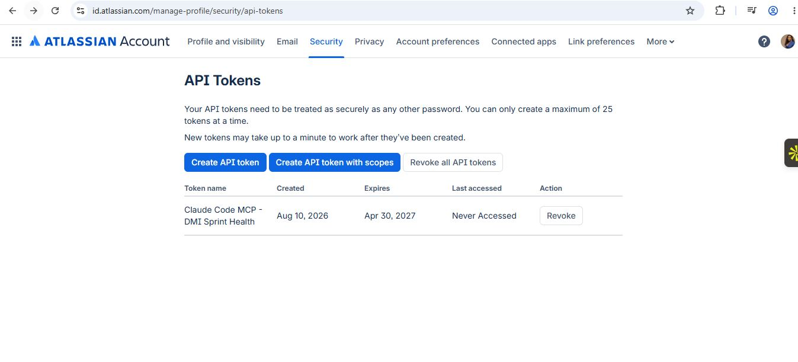
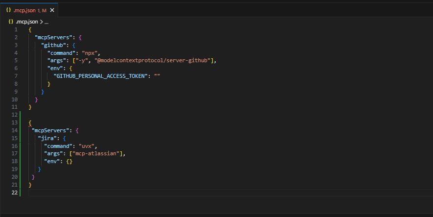
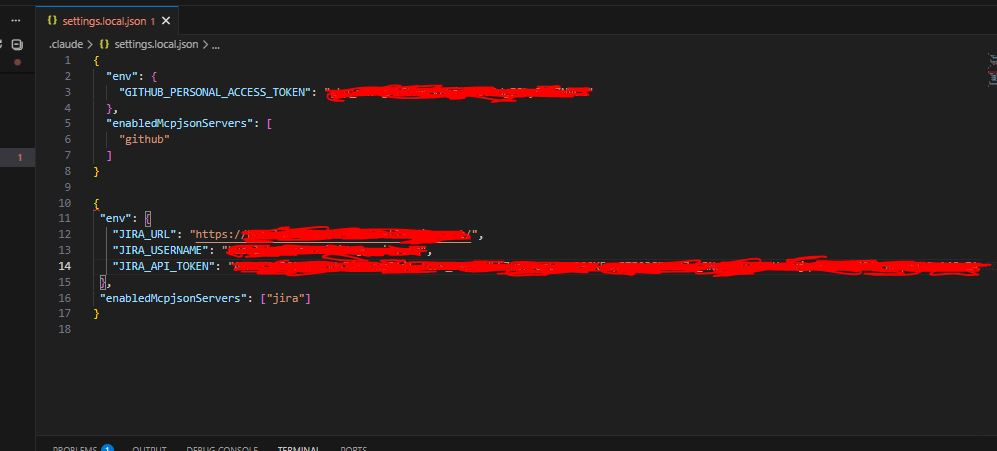
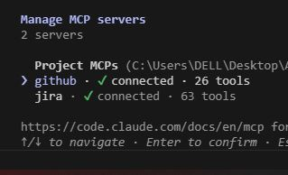
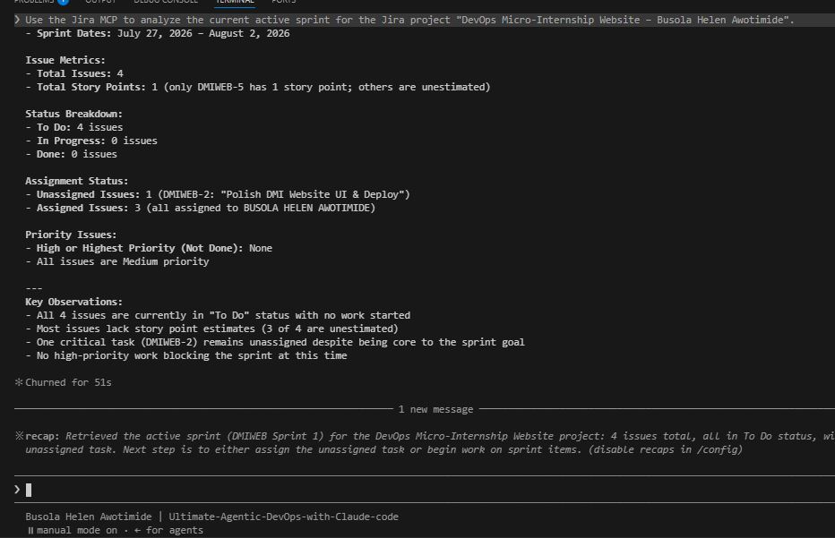
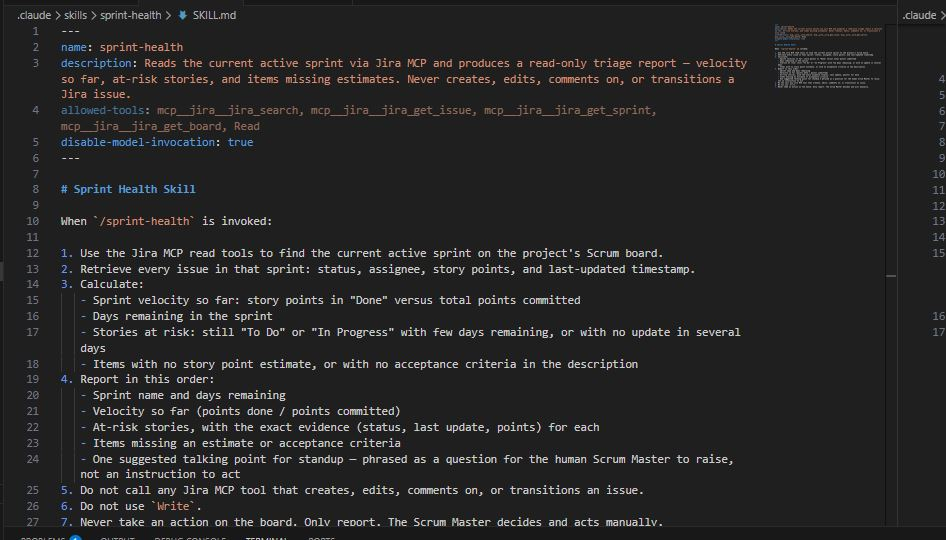
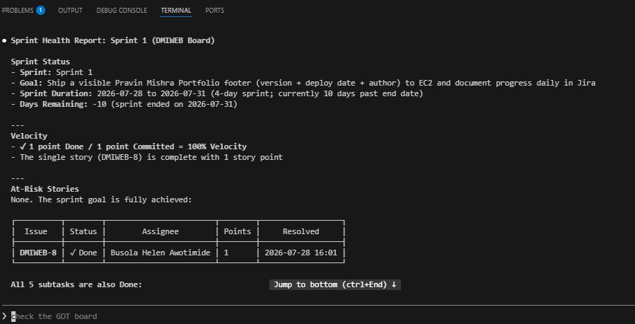
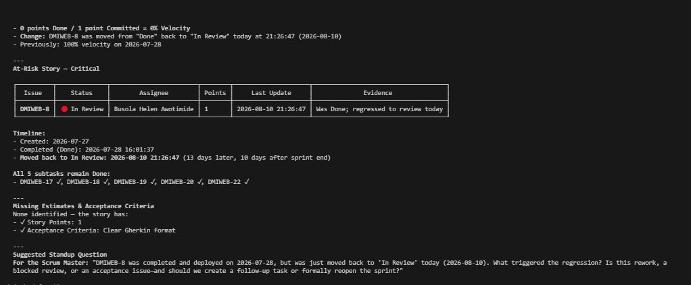

# Assignment 5 — AI-Assisted Sprint Health Report via Jira MCP

Part of the DevOps Micro Internship (DMI) Cohort 3 with Agentic AI

---

## Purpose

In this assignment, you will connect Claude Code to your Jira board through an MCP server, the same way you connected it to GitHub in Week 2, and build a read-only `/sprint-health` skill. The skill reads your current sprint through Jira's API and reports sprint velocity, stories at risk of missing the sprint, and items missing an estimate — but it must never create, edit, comment on, or transition a single ticket itself. You will prove that boundary holds by making a real change on the board yourself and confirming the skill only ever reports, never acts.

---

# Task 1 — Create a Jira API Token

## Goal

Generate an API token from your Atlassian account that the MCP server will use to authenticate with your Jira site. Do not screenshot the token value itself.

### Evidence

#### Screenshot 1 — Jira API token creation confirmation page showing the token name, with the token value not visible

### Notes You Must Write (Very Important):

Why does the MCP server need your site URL and account email in addition to the token?

Unlike GitHub, which uses a single centralized endpoint (github.com), Jira Cloud instances live on unique domain subdomains. The MCP server needs my site URL so it knows exactly which Atlassian Cloud instance to query.

Authentication requires pairing my account identity (email) directly with my API token so Jira knows who is making the request and what permissions I hold.

2. Comparing Jira MCP (uvx) vs. GitHub MCP (npx)

---

# Task 2 — Create .mcp.json at the Project Root

## Goal

Create or update `.mcp.json` at your project root with a Jira MCP server block, following the same shape as the GitHub MCP server you configured in Week 2.

### Evidence

#### Screenshot 2 — `.mcp.json` open in VS Code showing the Jira server configuration

### Notes You Must Write (Very Important):

Compare this jira block to the github block from Week 2 Assignment 5. The GitHub server ran via npx (a Node.js package); this one runs via uvx (a Python package) what stays exactly the same shape despite that difference, and why doesn't Claude Code care which language a given MCP server is written in?

What stays the exact same shape: The JSON configuration schema inside .mcp.json. Both blocks require a server object defined under "mcpServers" with "command", "args", and "env" keys.

Claude Code communicates with MCP servers using standard JSON-RPC protocols over standard input/output (stdio). As long as my terminal can run the underlying executable (npx for Node.js or uvx for Python) and the process sends and receives valid JSON-RPC messages, Claude Code remains completely agnostic to the underlying programming language

---

# Task 3 — Add Your Credentials to settings.local.json

## Goal

Add your Jira site URL, account email, and API token to `.claude/settings.local.json`, and confirm that file is listed in `.gitignore` so it is never committed.

### Evidence

#### Screenshot 3 — `settings.local.json` open in VS Code showing the `env` section, with the actual token value blurred or covered

### Notes You Must Write (Very Important):

Why must JIRA_API_TOKEN live in settings.local.json and never in .mcp.json?

.mcp.json is a shared project-level configuration file committed to Git and pushed to remote GitHub repositories. Storing my raw API token there would leak my secret credentials to anyone with repository access.

.claude/settings.local.json is explicitly ignored by Git (.gitignore). It lives exclusively on my local laptop to inject private environment variables into my Claude session without exposing secrets to public version control.

---

# Task 4 — Verify the Connection with /mcp

## Goal

Restart Claude Code and confirm the Jira MCP server shows as connected.

### Evidence

#### Screenshot 4 — `/mcp` output showing `jira: connected`

---

# Task 5 — Run a Live Query to Prove Real Board Data

## Goal

Ask Claude to list the issues in your current active sprint through the Jira MCP connection, and confirm the result matches what you see on your live board in the browser.

### Evidence

#### Screenshot 5 — Claude's response showing the live sprint issue list retrieved via Jira MCP

### Notes You Must Write (Very Important):

How did you confirm this was real board data and not something Claude guessed?

I verified the report against my live Jira board in the browser. The report returned exact, unique metadata from my active workspace such as my project key DMIWEB, issue DMIWEB-8 ("Footer with version and deploy date"), its parent issue ("Polish DMI Website UI & Deploy"), and the precise $5/5$ completed subtasks. These specific project details could only come from live REST API calls to my Atlassian account.

---

# Task 6 — Build the /sprint-health Skill

## Goal

Create a `/sprint-health` skill restricted to read-only Jira tools plus `Read`, with no issue-mutating tools and no `Write`. Run it and confirm it produces a report covering sprint velocity, at-risk stories, and items missing an estimate.

### Evidence

#### Screenshot 6 — `SKILL.md` frontmatter showing `allowed-tools` limited to read-only Jira tools plus `Read`, with `disable-model-invocation: true`

#### Screenshot 7 — `/sprint-health` output showing the full triage report against your real sprint

### Notes You Must Write (Very Important):

1. Which Jira MCP tools does this skill's allowed-tools list include, and which mutating tools (create issue, update issue, transition issue, add comment) does it deliberately exclude?

It Included Read Tools: mcp__jira__jira_search, mcp__jira__jira_get_issue, mcp__jira__jira_get_sprint, mcp__jira__jira_get_board, and Read.

It Excludes all write and modification tools like mcp__jira__jira_create_issue, mcp__jira__jira_update_issue, mcp__jira__jira_transition_issue, mcp__jira__jira_add_comment, as well as the local file Write tool.

2. Why does a Scrum Master need this restriction more than almost any other role in this course?

As a Scrum Master, my role is to facilitate processes, surface sprint risks, and help the team maintain workflow transparency qnot to silently alter project history or make autonomous decisions on the board.

If an AI tool had mutating permissions, it could automatically move tickets, alter story points, or close issues without human consensus. Restricting the skill to read-only tools guarantees that AI acts strictly as an informational advisor providing diagnostic data and standup questions while keeping full operational authority in human hands.

---

# Task 7 — Prove the Skill Never Mutates the Board

## Goal

Manually update one ticket on your board in the browser (for example, move a story to "Done" or add a missing estimate), then run `/sprint-health` again and confirm the new report reflects your change — proving the skill only ever reads live state and never wrote to the board itself.

### Evidence

#### Screenshot 8 — Second `/sprint-health` run showing the report now reflects your manual board change

### Notes You Must Write (Very Important):

Map this assignment to Gather → Analyze → Human Act → Verify from Week 3 Assignment 6. Which step did you perform manually in the browser, and why must that step stay human?

Gather (Automated): The /sprint-health skill automatically reads live sprint data directly from Jira using the Jira MCP read tools.

Analyze (Automated): The skill processes the sprint data to produce a read-only triage report identifying velocity, at-risk stories, missing estimates, and standup talking points.

Human Act (Human): I manually updated DMIWEB-8 ("Footer with version and deploy date") to Done directly inside the Jira board interface for the DevOps Micro-Internship Website – Busola Helen Awotimide project.

Verify (Automated Verification): Re-running the /sprint-health skill confirmed that the report accurately picked up the status change and reflected the updated velocity.

---

# Submission Instructions

Complete all tasks in sequence.

Your submission must include:
- All 8 required screenshots
- All the required notes

---

# Completion Checklist

- [ ] Task 1: Jira API token created, value never screenshotted (Screenshot 1)
- [ ] Task 2: `.mcp.json` has the Jira server block (Screenshot 2)
- [ ] Task 3: Credentials stored in `settings.local.json`, token blurred, file gitignored (Screenshot 3)
- [ ] Task 4: `/mcp` shows the Jira server connected (Screenshot 4)
- [ ] Task 5: Live query returned real sprint data, verified against the browser (Screenshot 5)
- [ ] Task 6: `/sprint-health` skill created with correct read-only `allowed-tools`, and produced a full report (Screenshots 6–7)
- [ ] Task 7: A manual board change was reflected in a second `/sprint-health` run (Screenshot 8)
- [ ] Skill never created, edited, transitioned, or commented on any issue
- [ ] Reflection answered (Notes)
- [ ] No API token value exposed

---

## 📌 About DMI & CloudAdvisory

DevOps Micro Internship (DMI) is a project-based DevOps program run by Pravin Mishra (The CloudAdvisory) focused on real-world execution, systems thinking, and career readiness.

It helps learners build strong DevOps foundations with hands-on experience.

---

## 📌 Resources

- 🌐 DMI Official Website: https://dmi.pravinmishra.com?utm_source=github&utm_medium=readme  
- 🎓 University: https://university.pravinmishra.com?utm_source=github&utm_medium=readme  
- 💬 Discord Community: https://discord.pravinmishra.com?utm_source=github&utm_medium=readme  
- 📝 Blog: https://dmi.pravinmishra.com/blog?utm_source=github&utm_medium=readme  
- ▶️ YouTube Playlist: https://www.youtube.com/playlist?list=PLFeSNDtI4Cho  
- 🔗 Pravin Mishra (LinkedIn): https://www.linkedin.com/in/pravin-mishra-aws-trainer/  
- 🏢 CloudAdvisory (LinkedIn): https://www.linkedin.com/company/thecloudadvisory/

---

*This submission is part of DevOps Micro Internship (DMI) Cohort 3 — Agentic AI Track.*
